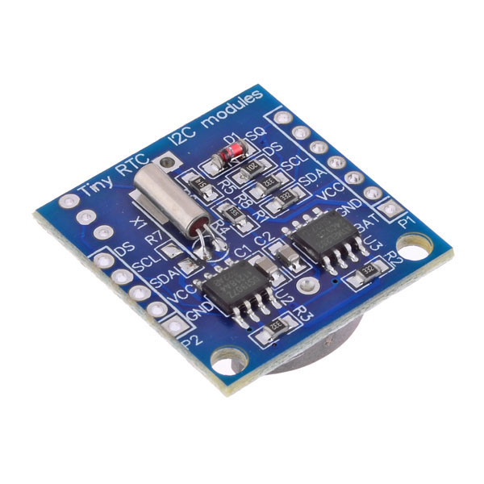
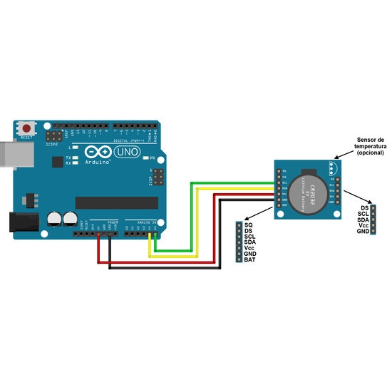
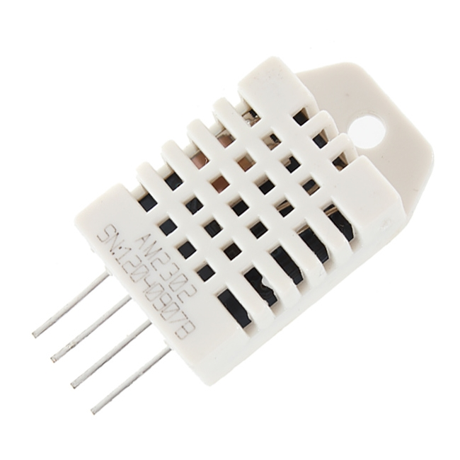
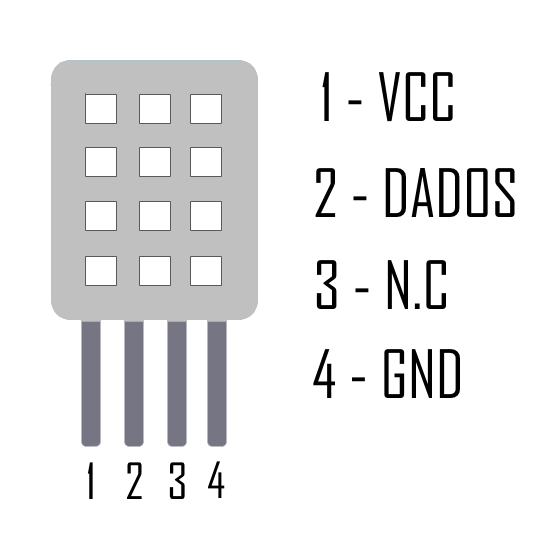
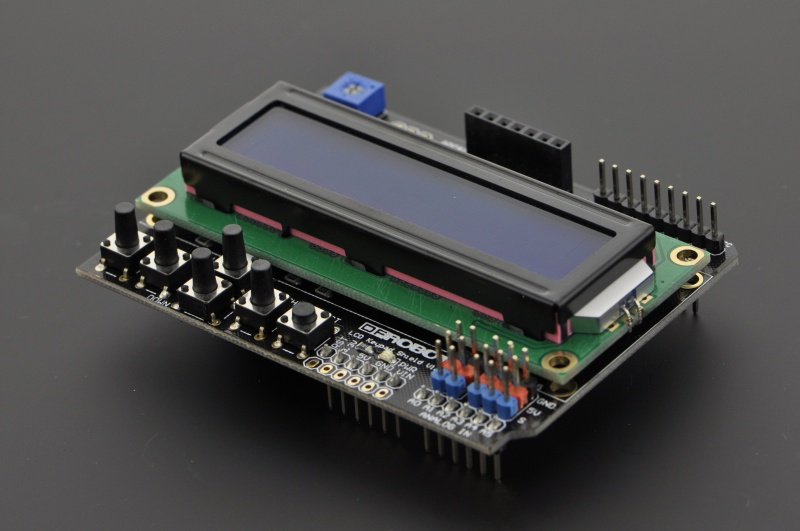
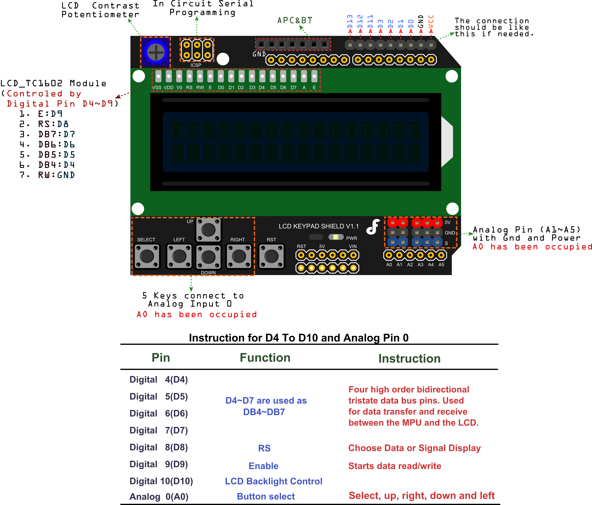

# RTCeTempArduino  
Projeto utilizando Arduíno, módulo Real Time Clock para relógio e DHT22 para leitura de temperatura e umidade

Este projeto usa os seguintes módulos  
RTC DS1307 - modulo Real Time Clock  
AM2303 DHT22 - mudulo leitura de temperatura e umidade  
LCD KEYPAD SHIEL DFROBOT DFR0009 - shield com display de cristal liquido 16x2 e botões  

### pinos usados no projeto:  
#### Digitais:
- D3 - Conectado ao DATA do DTH  
- D4 - Conectado ao pino de dados do LCD KEYPAD SHIELD  
- D5 - Conectado ao pino de dados do LCD KEYPAD SHIELD  
- D6 - Conectado ao pino de dados do LCD KEYPAD SHIELD  
- D7 - Conectado ao pino conectado de LCD KEYPAD SHIELD  
- D8 - Conectado ao pino RS do LCD KEYPAD SHIELD  
- D9 - Conectado ao pino ENABLE do LCD KEYPAD SHIELD  
- D10 - Conectado 10 pino BackLight do LCD KEYPAD SHIELD  
 
 ### Analógicos:  
 - A0 - Conectado ao botões do LCD KEYPAD SHIELD   
 - A4 - conectado ao pino SDA do módulo RTC  
 - A5 - Conectado ao pino SCL Do módulo RTC  

------  

## Módulo RTC

------  

## Módulo DHT22

------  

## LCD KEYPAD SHIELD

